# 🚚 Abdullah Bukhari Transport & Logistics – Corporate Website

A modern, multilingual corporate website built for **Abdullah Bukhari Transport & Logistics Services** to strengthen the company’s digital presence and professionally showcase its operations across Saudi Arabia. The platform presents all core services through a clean, responsive, and scalable frontend, delivering a strong corporate identity aligned with enterprise standards.

The website improved content clarity and service discoverability across **7 core services**, enhanced user engagement through a modern UI and smooth animations, and was built with an **SEO-friendly structure and semantic HTML** to support long-term visibility and growth.

---

## 🔧 Features

### 🏢 Corporate Services Showcase

- Clear presentation of all company services in a structured layout
- Dedicated pages for each service offering
- Enterprise-level design aligned with corporate branding

### 🌍 Multilingual Experience

- Full Arabic and English support
- RTL / LTR layout compatibility
- Language persistence for consistent user experience

### 🎨 UI / UX Design

- Modern, clean interface with smooth animations
- Dark / Light mode with saved user preference
- Fully responsive design (desktop, tablet, mobile)

### 📄 Pages & Content

- Dedicated service pages for:
  - Water Production & Supply
  - Transport & Logistics
  - Hajj & Umrah Bus Services
  - Heavy Transport
  - Car Rental
  - Logistics Management
  - Digital Marketing
- Interactive homepage with hero carousel and company statistics
- Partner and client showcase to enhance credibility

### 📞 Communication & Contact

- Multiple contact forms (Clients, Jobs, Request a Quote)
- WhatsApp integration for direct communication
- Clear company contact and social media links

---

## 💡 Impact

- Improved content clarity and service discoverability across **7 services**
- Enhanced user engagement through modern UI and smooth animations
- Built with SEO-friendly structure and semantic HTML
- Provided a scalable digital foundation for future corporate expansion

---

## 📦 Tech Stack

| Layer    | Tech                             |
| -------- | -------------------------------- |
| Frontend | React.js, TypeScript, Vite       |
| i18n     | react-i18next (English / Arabic) |
| Styling  | TailwindCSS, next-themes         |

---

## 🌐 Deployment Notes

- Fully responsive and cross-browser compatible
- Optimized for performance and SEO
- Designed for scalability and future service expansion

---

## 🎬 Site Demo

**[▶ Watch site walkthrough](./src/docs/bukhari-video-demo.mp4)**

Home hero → about → services grid → water → transport → Hajj & Umrah buses → heavy transport → car rental → logistics → digital marketing → mobile preview.

---

## 📸 Screenshots

<table>
  <tr>
    <td width="50%" valign="top">
      <strong>Home Hero</strong> 
      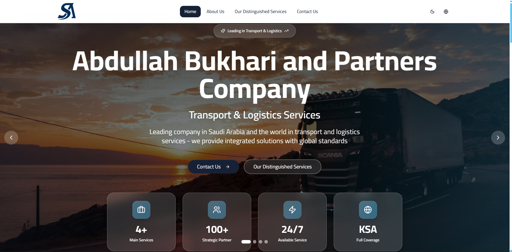
    </td>
    <td width="50%" valign="top">
      <strong>About Us</strong> 
      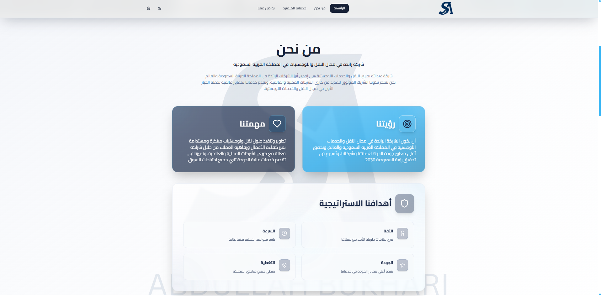
    </td>
  </tr>
  <tr>
    <td width="50%" valign="top">
      <strong>Our Services</strong> 
      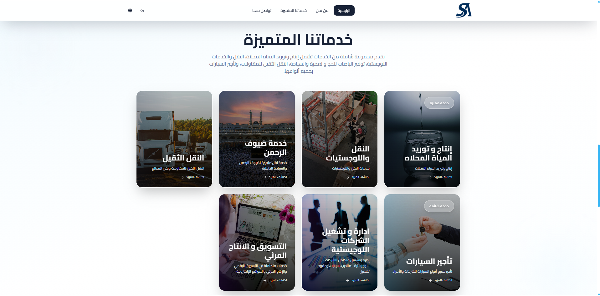
    </td>
    <td width="50%" valign="top">
      <strong>Water — Hero</strong> 
      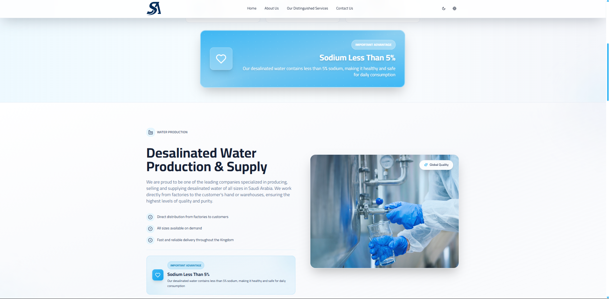
    </td>
  </tr>
  <tr>
    <td width="50%" valign="top">
      <strong>Water — Content</strong> 
      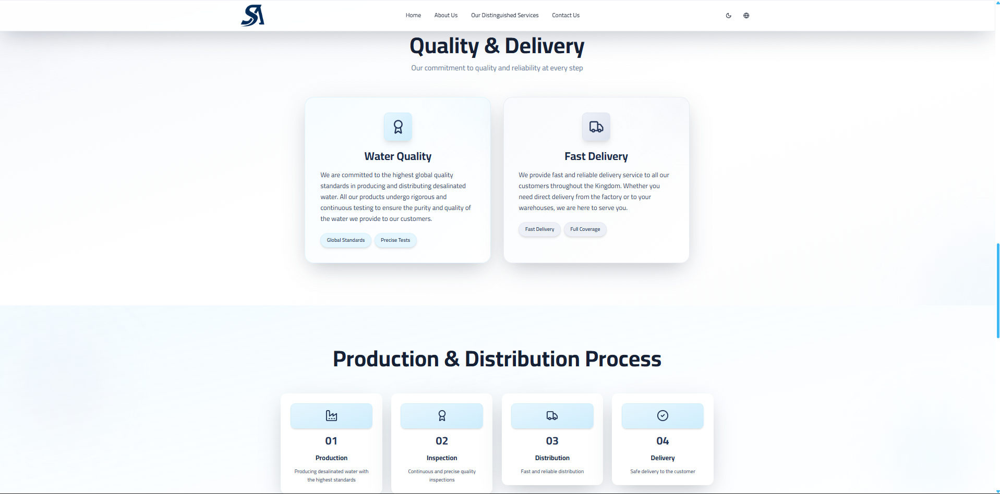
    </td>
    <td width="50%" valign="top">
      <strong>Transport — Hero</strong> 
      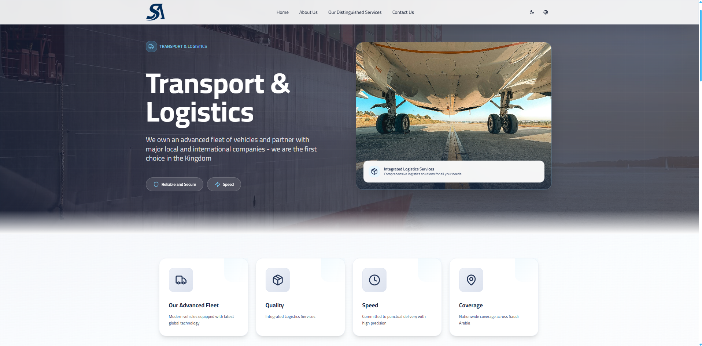
    </td>
  </tr>
  <tr>
    <td width="50%" valign="top">
      <strong>Transport — Content</strong> 
      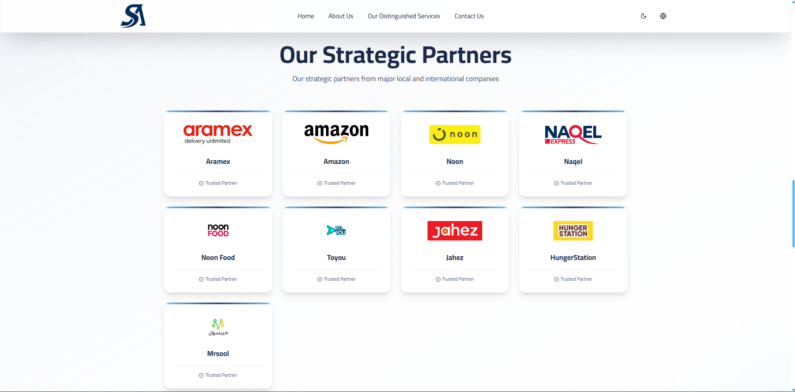
    </td>
    <td width="50%" valign="top">
      <strong>Hajj & Umrah Buses — Hero</strong> 
      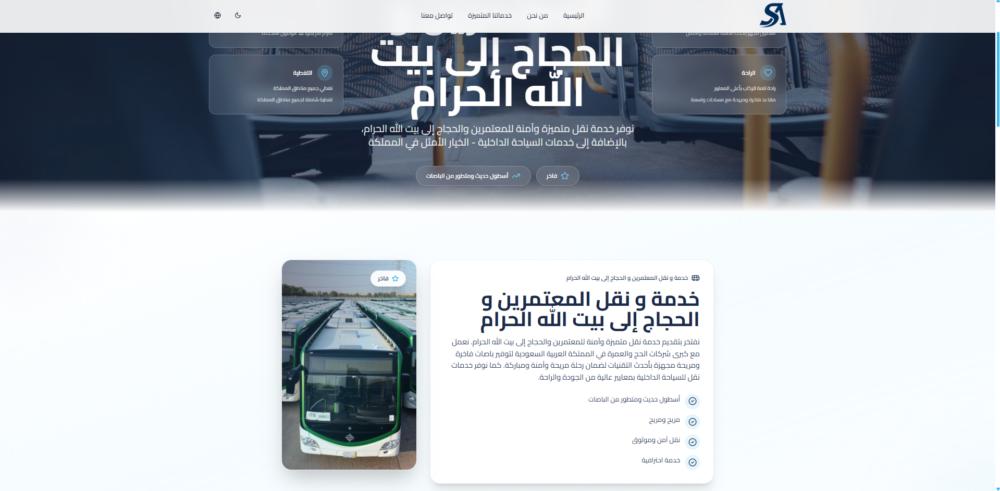
    </td>
  </tr>
  <tr>
    <td width="50%" valign="top">
      <strong>Hajj & Umrah Buses — Content</strong> 
      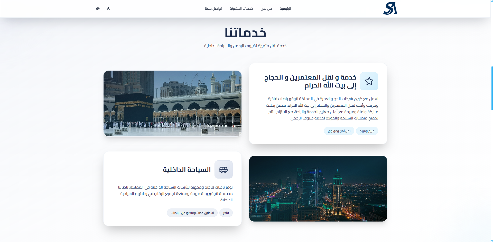
    </td>
    <td width="50%" valign="top">
      <strong>Heavy Transport</strong> 
      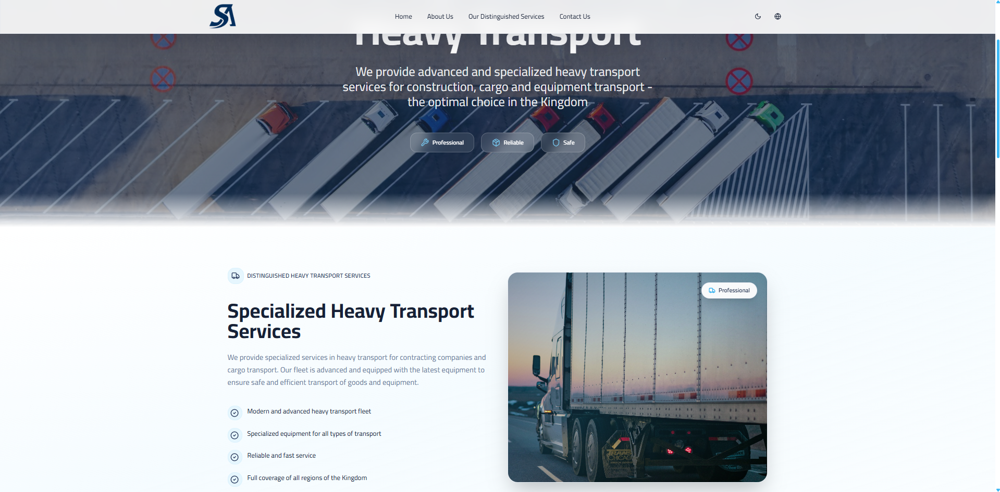
    </td>
  </tr>
  <tr>
    <td width="50%" valign="top">
      <strong>Car Rental</strong> 
      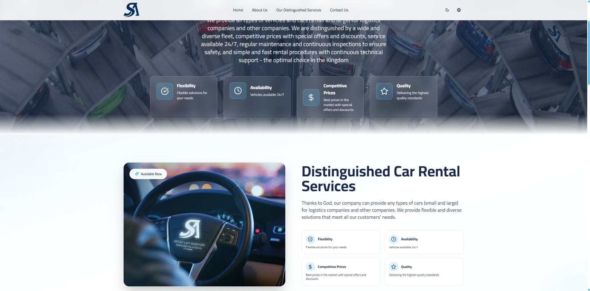
    </td>
    <td width="50%" valign="top">
      <strong>Logistics Management</strong> 
      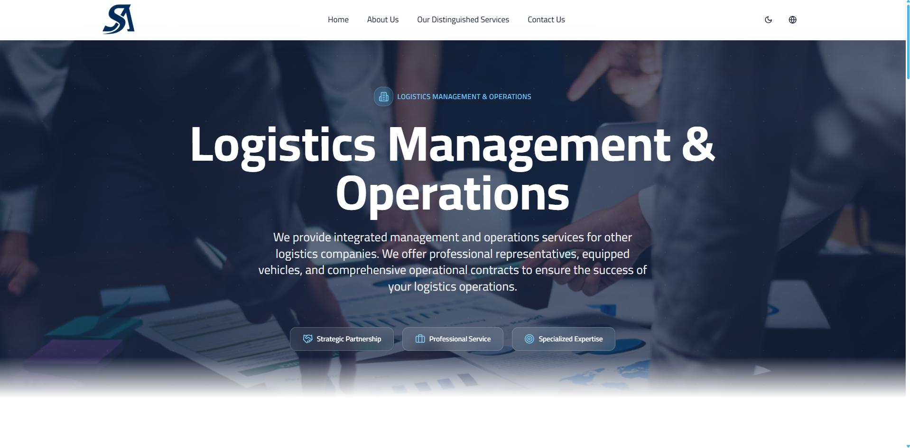
    </td>
  </tr>
  <tr>
    <td width="50%" valign="top">
      <strong>Digital Marketing</strong> 
      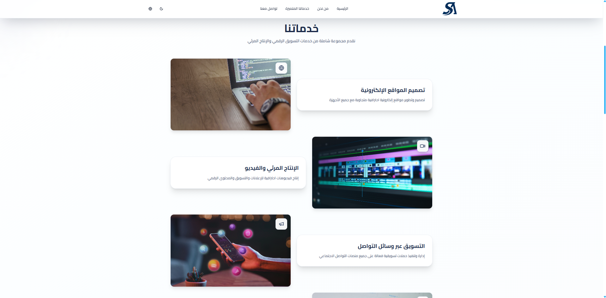
    </td>
    <td width="50%" valign="top">
      <strong>Mobile Home</strong> 
      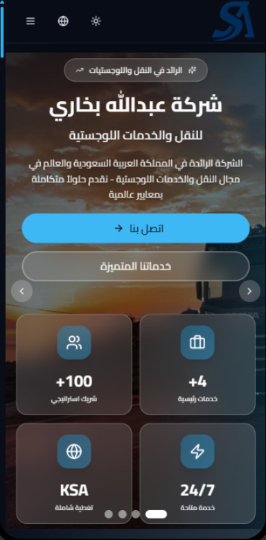
    </td>
  </tr>
</table>

## Live Demo 🚀

[**View Live Demo**](https://www.logistics-as.com/)

---

## Author

👤 **Omar Mahmoud**
📧 [omrmhd54@gmail.com](mailto:omrmhd54@gmail.com)
💼 [LinkedIn](https://www.linkedin.com/in/omrmhd5/)
🌐 [Portfolio](https://omarmahmoud.dev/)
🔗 [GitHub](https://github.com/omrmhd5)
